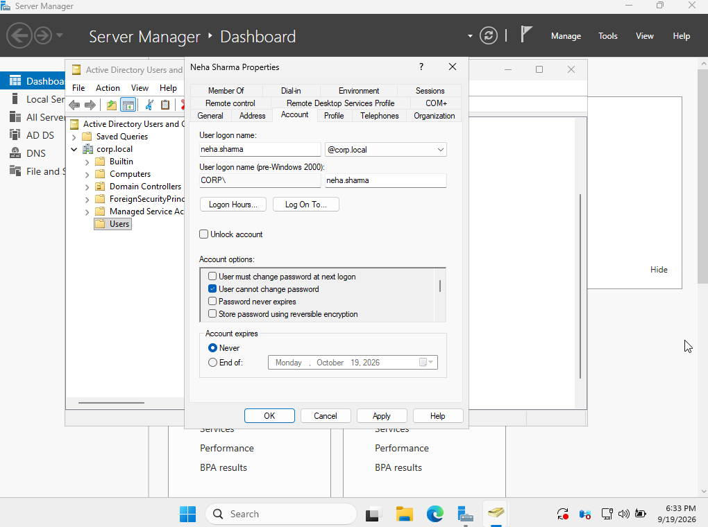
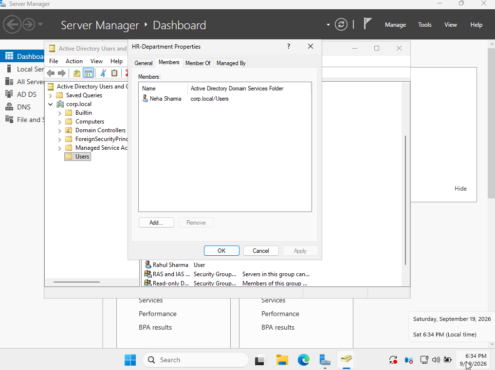

# Ticket 01 — Create Active Directory User

## Ticket

> Create a new domain account for a new HR employee.

## User Details

- Name: Neha Sharma
- Username: `neha.sharma`
- Domain: `corp.local`
- Department: HR

## Objective

Create a domain user account for the new HR employee and assign the appropriate department group.

## Procedure

1. Opened **Server Manager** on `DC01`.
2. Navigated to **Tools → Active Directory Users and Computers**.
3. Created a new user account for **Neha Sharma**.
4. Configured the username as `neha.sharma`.
5. Configured the initial account settings.
6. Enabled **User cannot change password** for this lab account.
7. Created the account.
8. Created the `HR-Department` security group.
9. Added `Neha Sharma` as a member of the `HR-Department` group.

## Verification

The account properties were checked in Active Directory Users and Computers, and group membership was verified through the `HR-Department` group's Members tab.

## Screenshots

### User Account Configuration

### HR Department Group Membership

## Skills Practiced

- Active Directory Users and Computers
- Domain user creation
- Security group creation
- Group membership management
- Windows Server administration

## Security Note

No passwords or authentication credentials are stored in this repository.
