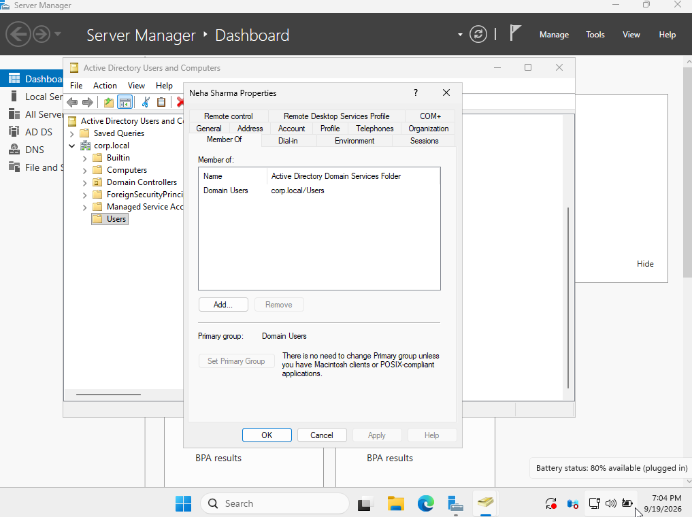
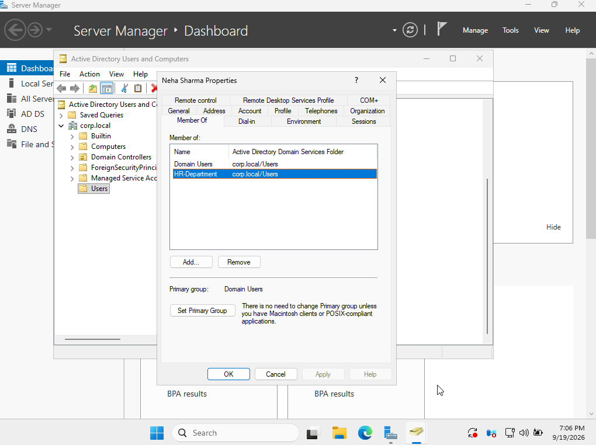

# Ticket 02 — Add User to Security Group

## Ticket

> Add the HR employee to the appropriate department security group.

## User Details

- Name: Neha Sharma
- Username: `neha.sharma`
- Domain: `corp.local`
- Department: HR
- Security Group: `HR-Department`

## Objective

Add the HR employee to the `HR-Department` security group and verify the membership.

## Procedure

1. Opened **Active Directory Users and Computers** on `DC01`.
2. Located **Neha Sharma**.
3. Verified that `HR-Department` was not listed under **Member Of**.
4. Added `Neha Sharma` to the `HR-Department` security group.
5. Reopened the user's properties.
6. Verified that `HR-Department` appeared under **Member Of**.

## Verification

The user's group membership was verified through the **Member Of** tab in Active Directory Users and Computers.

## Screenshots

### Before Group Membership

### After Group Membership

## Skills Practiced

- Active Directory Users and Computers
- Security group management
- User group membership
- Windows Server administration
- Access management

## Security Note

No passwords or authentication credentials are stored in this repository.
