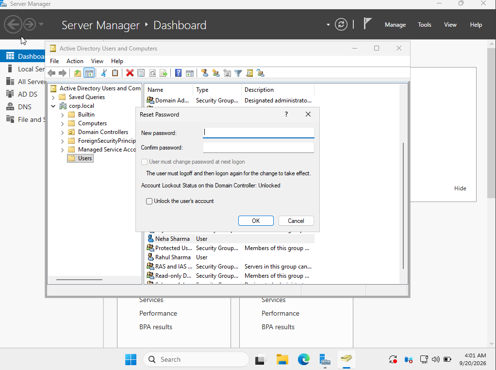
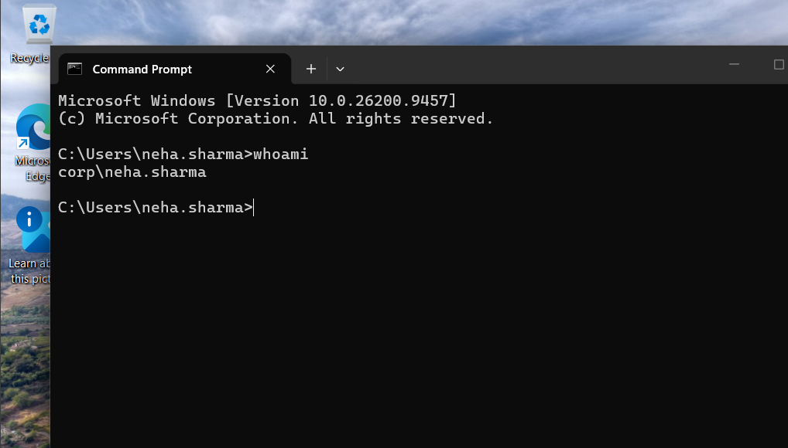

# Ticket 03 — Reset User Password

## Ticket

> Neha Sharma is unable to log in because she has forgotten her domain password. Reset her password and verify that she can authenticate successfully.

## User Details

- Name: Neha Sharma
- Username: `neha.sharma`
- Domain: `corp.local`
- Domain Controller: `DC01`

## Objective

Reset the user's Active Directory password and verify successful domain authentication.

## Procedure

1. Opened **Active Directory Users and Computers** on `DC01`.
2. Located **Neha Sharma**.
3. Used **Reset Password** to assign a temporary password.
4. Ensured the password satisfied the domain password policy.
5. Logged into the Windows 11 client using the domain account.
6. Verified the authenticated domain account using `whoami`.

## Verification


The `whoami` command returned:


```text
corp\neha.sharma


## Screenshots

### Password Reset



### Successful Domain Login



## Skills Practiced

- Active Directory Users and Computers
- Active Directory password management
- Domain authentication
- Windows user administration
- Command-line verification

## Security Note

No passwords or authentication credentials are stored in this repository.

```text
corp\neha.sharma
