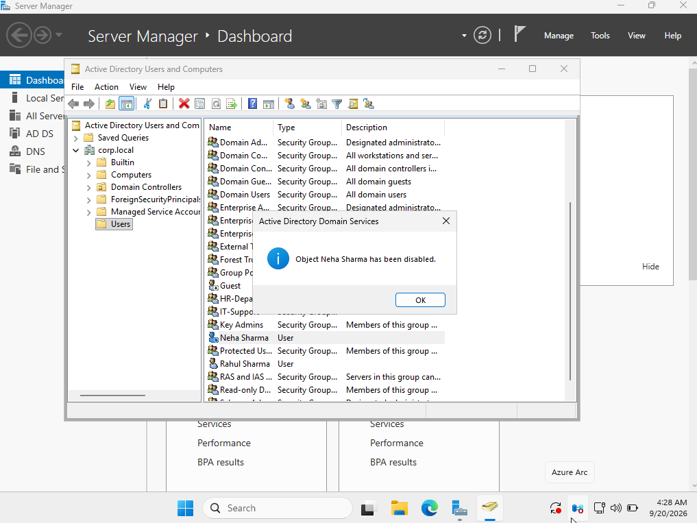
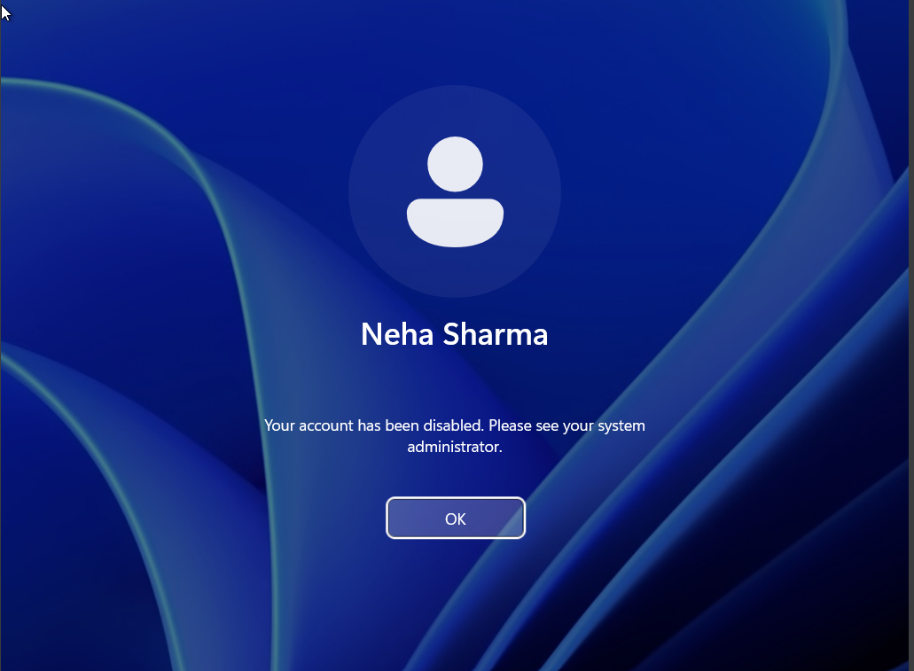

# Ticket 04 — Disable User Account

## Ticket

> Neha Sharma has left the organization. Disable her domain account immediately to prevent further authentication.

## User Details

- Name: Neha Sharma
- Username: `neha.sharma`
- Domain: `corp.local`
- Domain Controller: `DC01`

## Objective

Disable the user's Active Directory account and verify that the account can no longer be used for domain authentication.

## Procedure

1. Opened **Active Directory Users and Computers** on `DC01`.
2. Located **Neha Sharma**.
3. Used **Disable Account** to disable the user's domain account.
4. Verified that the account was disabled.
5. Attempted to authenticate from the Windows 11 client using `corp\neha.sharma`.
6. Verified that authentication was rejected because the account was disabled.

## Verification

The Active Directory account was disabled successfully, and the disabled account could no longer authenticate to the domain.

## Screenshots

### Disabled Account

### Disabled Account Login Attempt

## Skills Practiced

- Active Directory Users and Computers
- User account management
- Account disabling
- Domain authentication troubleshooting
- Windows administration

## Security Note

No passwords or authentication credentials are stored in this repository.
