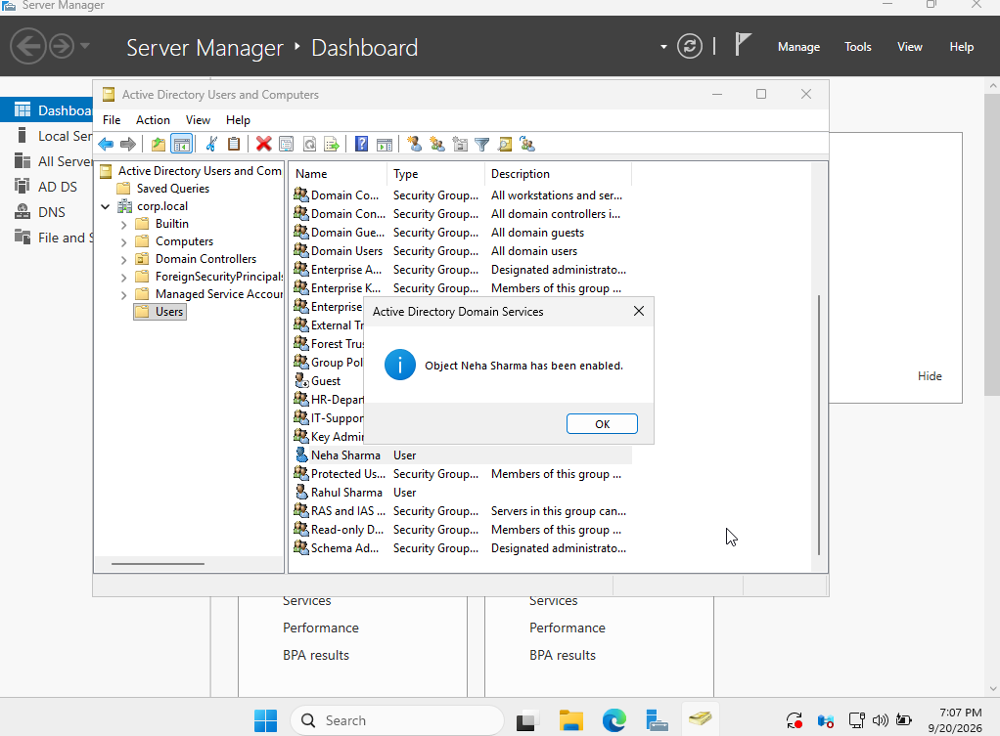
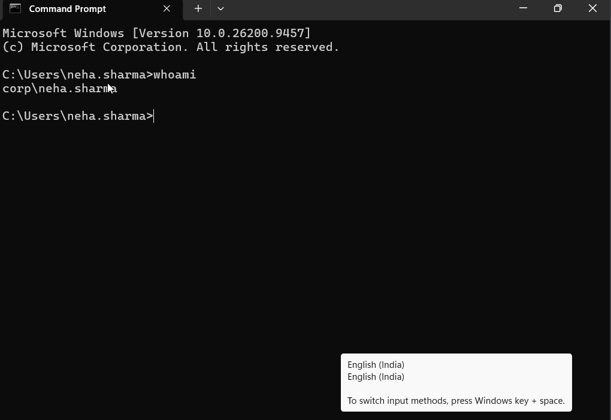

# Ticket 05 — Re-enable User Account

## Ticket

> Neha Sharma has returned to the organization. Re-enable her previously disabled Active Directory account and verify that she can authenticate again.

## User Details

- Name: Neha Sharma
- Username: `neha.sharma`
- Domain: `corp.local`
- Domain Controller: `DC01`

## Objective

Re-enable the user's Active Directory account and verify that the account can be used for domain authentication again.

## Procedure

1. Opened **Active Directory Users and Computers** on `DC01`.
2. Located **Neha Sharma**.
3. Used **Enable Account** to re-enable the user's domain account.
4. Verified that the account was enabled.
5. Logged into the Windows 11 client using `corp\neha.sharma`.
6. Verified successful authentication using the `whoami` command.

## Verification

The Active Directory account was successfully re-enabled, and the user was able to authenticate to the domain again.

## Screenshots

### Enabled Account

### Successful Domain Login

## Skills Practiced

- Active Directory Users and Computers
- User account management
- Account re-enabling
- Domain authentication
- Windows administration

## Security Note

No passwords or authentication credentials are stored in this repository.
