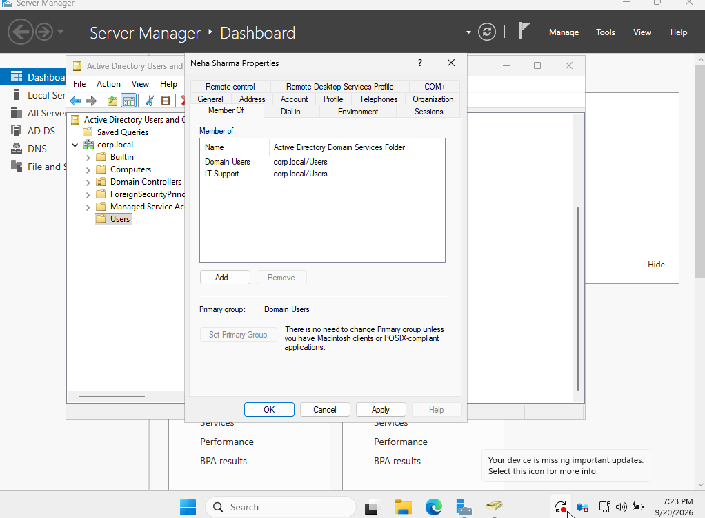
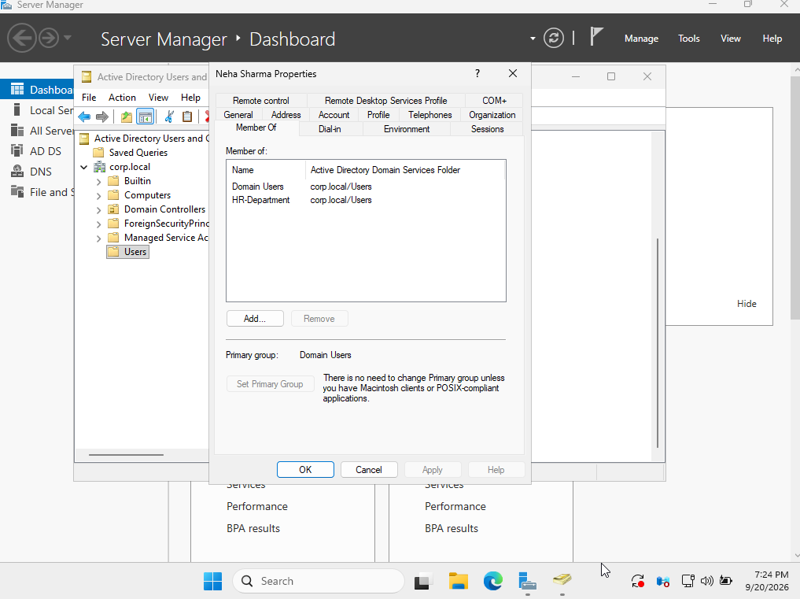

# Ticket 06 — Fix Incorrect Group Membership

## Ticket

> Neha Sharma is assigned to the wrong department group. Remove the incorrect group membership and add her to the correct `HR-Department` security group.

## User Details

- Name: Neha Sharma
- Username: `neha.sharma`
- Domain: `corp.local`
- Correct Group: `HR-Department`

## Objective

Correct the user's Active Directory group membership and verify that she belongs to the appropriate security group.

## Procedure

1. Opened **Active Directory Users and Computers** on `DC01`.
2. Located **Neha Sharma**.
3. Identified the incorrect `IT-Support` group membership.
4. Removed `IT-Support` from the user's group memberships.
5. Added `Neha Sharma` to the `HR-Department` security group.
6. Reopened the user's **Member Of** tab.
7. Verified that `HR-Department` was present and `IT-Support` was absent.

## Verification

The user's group membership was corrected successfully. Neha Sharma is now a member of `HR-Department` and is no longer a member of `IT-Support`.

## Screenshots

### Incorrect Group Membership

### Correct Group Membership

## Skills Practiced

- Active Directory Users and Computers
- Security group management
- User group membership
- Access management
- Windows Server administration

## Security Note

No passwords or authentication credentials are stored in this repository.
