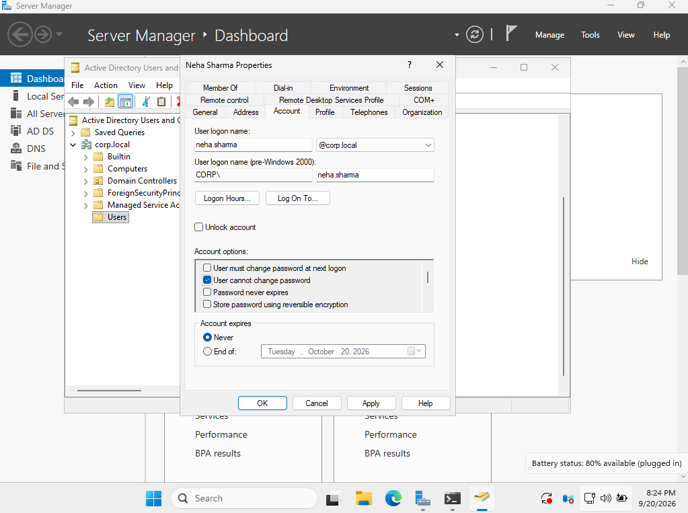
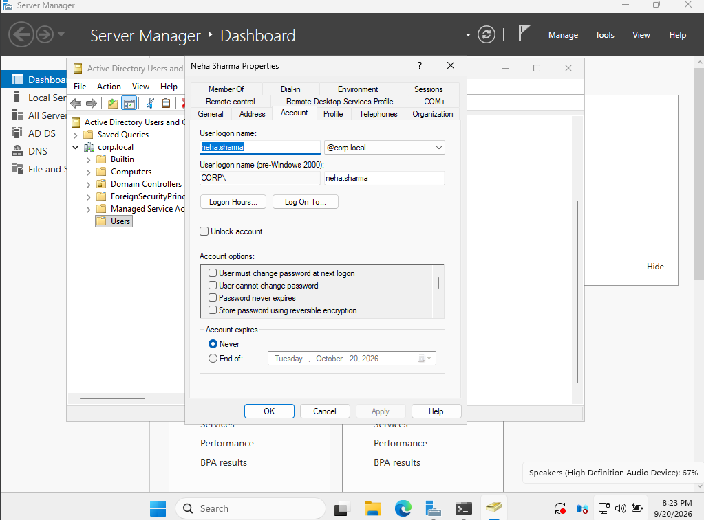

# Ticket 07 — User Cannot Change Password

## Problem

A domain user reported that they were unable to change their Windows password.

The issue was investigated from both the Active Directory user account settings and the domain password policy.

---

## Environment

- Domain: `corp.local`
- Domain Controller: `DC01`
- Client: `AcerLap`
- User: `Neha Sharma`
- Username: `neha.sharma`

---

## Investigation

The user's Active Directory account initially had the following option enabled:

**User cannot change password**

This account-level restriction prevents the user from changing their own password.

---

## Resolution

Opened:

**Active Directory Users and Computers → Users → Neha Sharma → Properties → Account**

The **User cannot change password** option was unchecked.

This removed the account-level restriction.

---

## Important Finding

The domain password policy configured in a previous ticket has:

- Minimum password age: **1 day**
- Minimum password length: **8 characters**
- Password complexity: **Enabled**
- Password history: **5 passwords**
- Maximum password age: **60 days**

Because the password had recently been reset by an administrator, the **1-day minimum password age** prevented an immediate password change.

Therefore, the account-level restriction was successfully removed, but an immediate password change could not be verified.

---

## Verification

The account was checked again in Active Directory Users and Computers.

The **User cannot change password** option was no longer selected.

This confirmed that the account-level restriction had been removed.

---

## Screenshots

### User Cannot Change Password — Initial Configuration

### Password Change Restriction Removed

---

## Skills Practiced

- Active Directory Users and Computers
- User account properties
- Password management
- Domain password policy
- Troubleshooting account-level restrictions
- Understanding minimum password age
- Windows domain administration

---

## Outcome

The account-level **User cannot change password** restriction was removed successfully.

An immediate password change was not verified because the domain's **1-day minimum password age** was still in effect after the administrator password reset.
