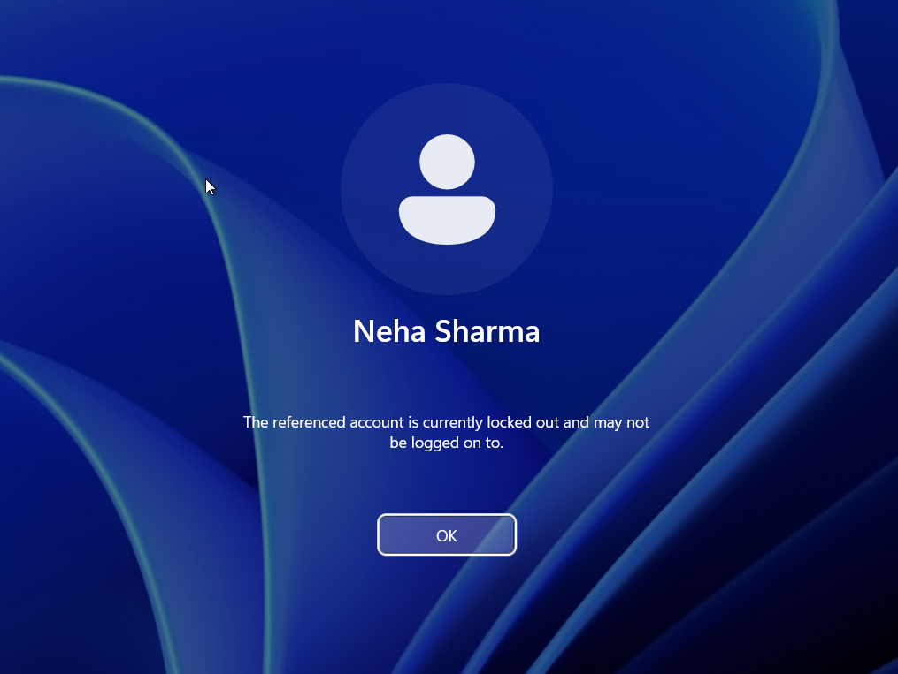
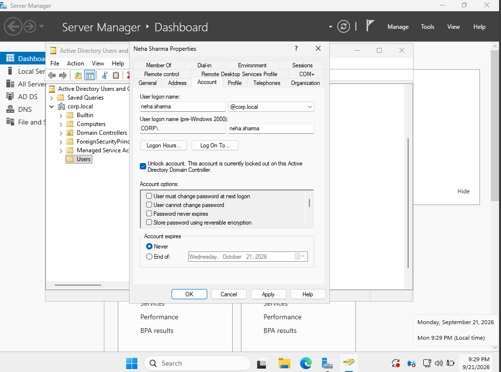

# Ticket 08 — Account Lockout and Unlock

## Scenario

A domain user reported that they could not log in after entering an incorrect password multiple times.

The help desk needed to verify whether the account had been locked out and restore access.

---

## Environment

- Domain Controller: `DC01`
- Client: `AcerLap`
- Domain: `corp.local`
- User: `Neha Sharma`
- Username: `neha.sharma`

---

## Problem

The user was unable to log in after multiple incorrect password attempts.

The domain account lockout policy was configured to lock an account after 3 invalid logon attempts.

---

## Troubleshooting

1. Intentionally entered an incorrect password multiple times for the test user.
2. Opened **Active Directory Users and Computers** on `DC01`.
3. Located the `Neha Sharma` account.
4. Verified that the account was locked.
5. Unlocked the account.
6. Attempted to log in again using the correct credentials.

---

## Resolution

The `Neha Sharma` account was unlocked in Active Directory.

The user was then able to successfully authenticate to the domain again.

---

## Verification

The account status was checked in Active Directory after the failed login attempts.

After unlocking the account, a successful domain login was confirmed.

---

## Screenshots

### Account Locked

### Successful Login After Unlock

---

## Skills Practiced

- Active Directory Users and Computers
- Account lockout troubleshooting
- User account administration
- Domain authentication
- Help-desk troubleshooting
- Account recovery
