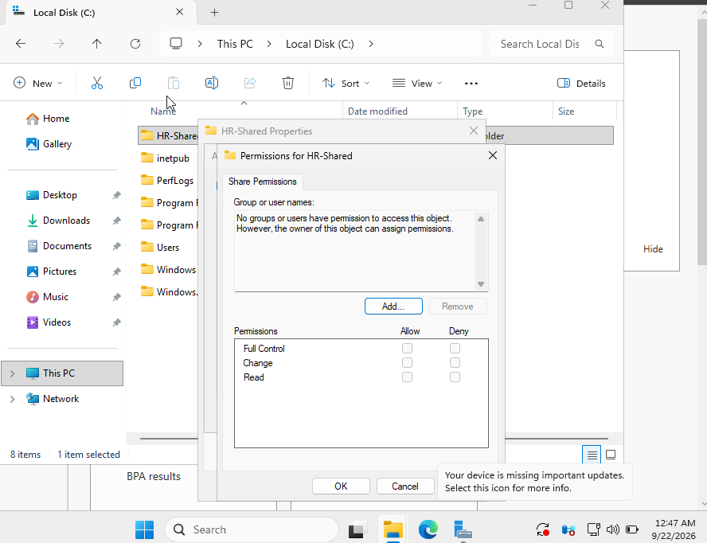
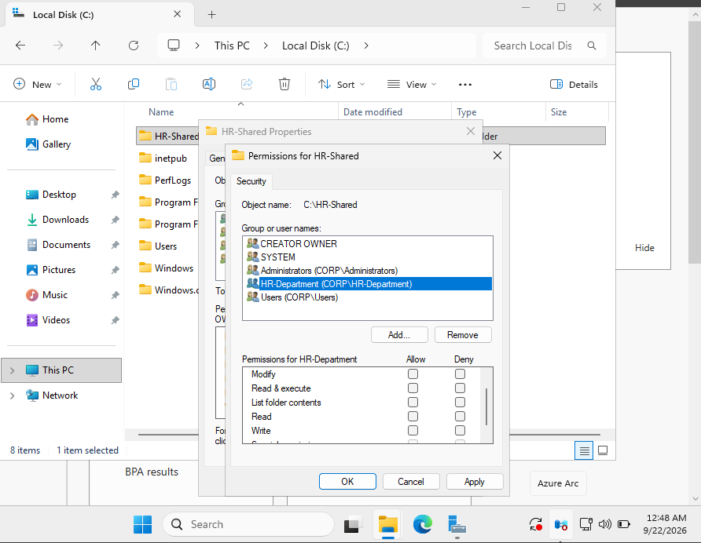
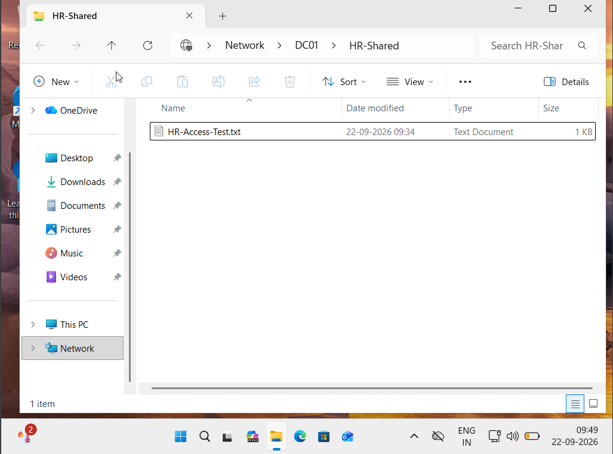

# Ticket 09 — Shared Folder Access Troubleshooting

## Scenario

A user from the HR department reported that they could not access the HR shared folder.

The help desk investigated the Windows file-sharing and NTFS permissions to identify and resolve the issue.

---

## Environment

- Domain Controller: `DC01`
- Client: `AcerLap`
- Domain: `corp.local`
- User: `Neha Sharma`
- AD Group: `HR-Department`
- Shared Folder: `HR-Shared`

---

## Problem

The HR shared folder had incorrect permissions, preventing the HR user from accessing the folder.

The issue was intentionally reproduced as part of this home lab to simulate a help-desk access incident.

---

## Troubleshooting

1. Attempted to access the shared folder from the Windows 11 client.
2. Checked the folder's Share permissions.
3. Checked the NTFS permissions under the Security tab.
4. Identified that the required permissions for the `HR-Department` group were missing.
5. Restored the appropriate NTFS permissions.
6. Retested access from the Windows 11 client.

---

## Resolution

The `HR-Department` security group was given the required read permissions on the shared folder.

The user was then able to access the shared folder successfully.

---

## Verification

The shared folder was accessed from the domain-joined Windows 11 client using:

`\\DC01\HR-Shared`

The test file inside the folder was successfully accessible.

---

## Screenshots

### Share Permissions During Troubleshooting

### NTFS Permissions During Troubleshooting

### Successful Access After Fix

---

## Skills Practiced

- Windows file sharing
- SMB shared folders
- NTFS permissions
- Active Directory security groups
- Access troubleshooting
- Domain user access verification
- Windows help-desk troubleshooting
