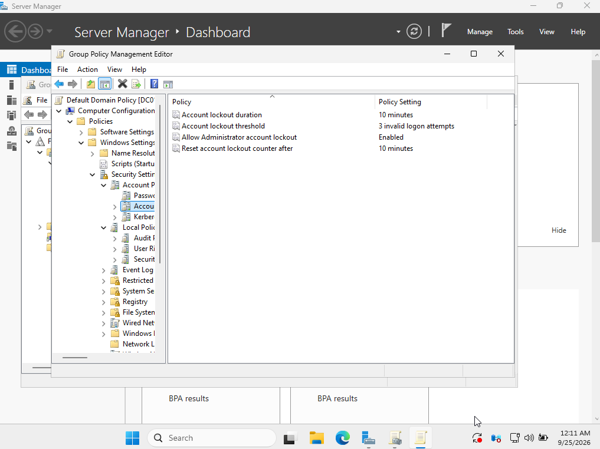
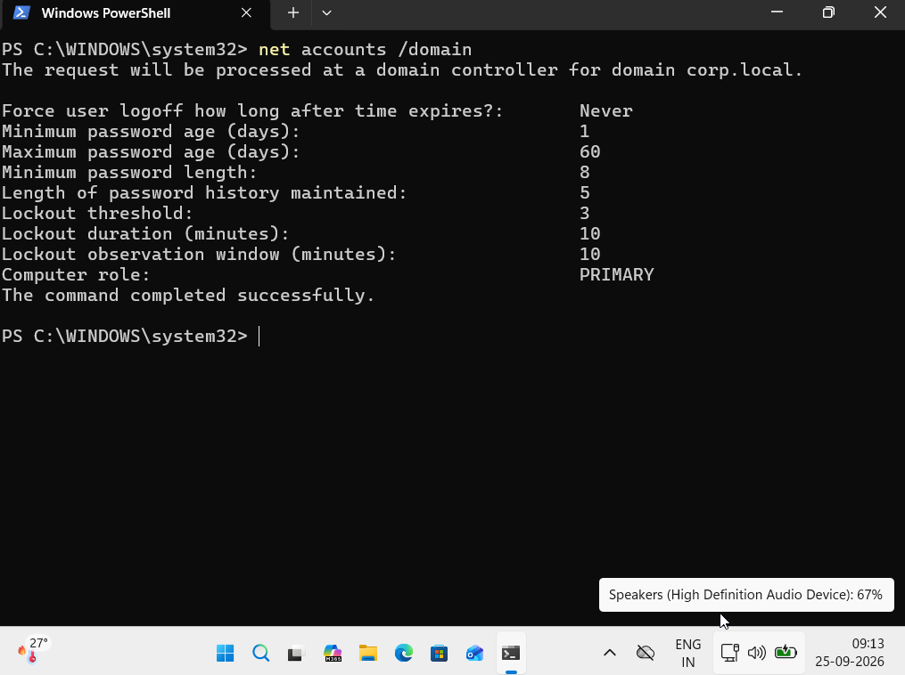

# Ticket 11 — Account Lockout Policy Configuration

## Scenario

The organization wanted to protect domain accounts against repeated incorrect password attempts.

The help desk configured an account lockout policy for domain users and verified that the settings were applied successfully.

---

## Environment

- Domain Controller: `DC01`
- Client: `AcerLap`
- Domain: `corp.local`

---

## Problem

The domain account lockout policy needed to be configured to protect user accounts from repeated failed authentication attempts.

The following requirements were requested:

- Account lockout threshold: 3 invalid logon attempts
- Account lockout duration: 10 minutes
- Reset account lockout counter after: 10 minutes

---

## Troubleshooting

1. Opened **Group Policy Management** on `DC01`.
2. Edited the **Default Domain Policy**.
3. Navigated to:
   `Computer Configuration → Policies → Windows Settings → Security Settings → Account Policies → Account Lockout Policy`
4. Configured the required account lockout settings.
5. Ran `gpupdate /force` on the Windows 11 client.
6. Verified the domain account lockout policy using:
   `net accounts /domain`

---

## Resolution

The domain account lockout policy was configured with the required settings.

The policy was successfully refreshed on the Windows 11 client and the configured values were verified.

---
## Screenshots

### Account Lockout Policy Configuration



### Account Lockout Policy Verification



## Verification

The account lockout policy was verified using:

```cmd
net accounts /domain
