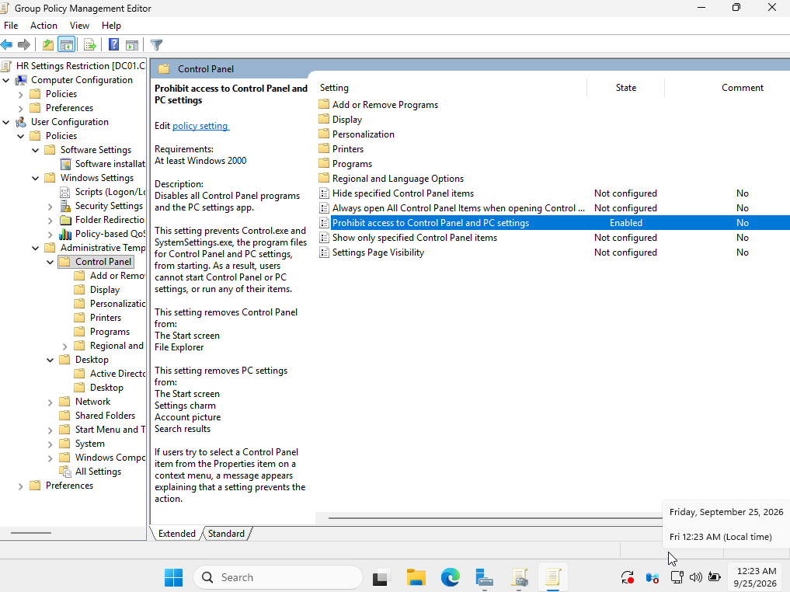
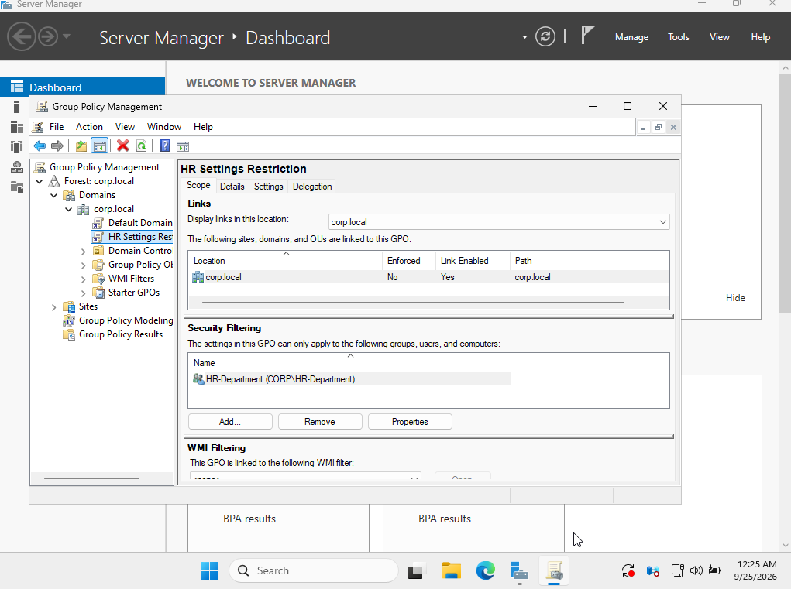
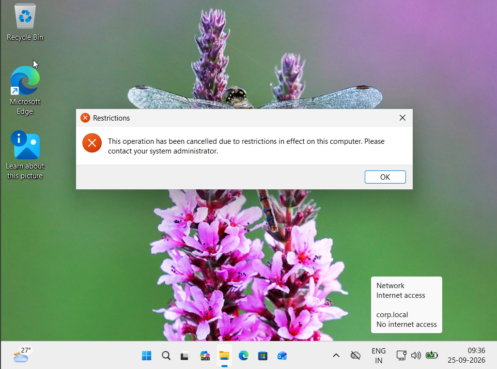

# Ticket 12 — GPO Restriction Not Working

## Scenario

A user reported that access to Control Panel and Windows Settings was not being restricted as expected.

The help desk investigated the Group Policy configuration, scope, and permissions to identify and resolve the issue.

---

## Environment

- Domain Controller: `DC01`
- Client: `AcerLap`
- Domain: `corp.local`
- User: `Neha Sharma`
- AD Group: `HR-Department`

---

## Problem

A Group Policy was configured to prevent users in the `HR-Department` group from accessing Control Panel and Windows Settings.

However, the restriction was not being applied to the user.

---

## Troubleshooting

1. Checked the Group Policy configuration.
2. Verified that the GPO was linked to the `corp.local` domain.
3. Verified that `HR-Department` was configured under Security Filtering.
4. Checked the GPO delegation and permissions.
5. Identified that the client computer required read access to the GPO.
6. Added `Domain Computers` with Read permission.
7. Refreshed Group Policy on the Windows 11 client.
8. Verified the restriction by logging in as the affected user.

---

## Resolution

The GPO permissions were corrected by allowing `Domain Computers` to read the GPO while keeping `HR-Department` as the security-filtered group.

The Group Policy was then successfully applied to the user.

---

## Verification

After refreshing Group Policy and signing in as Neha Sharma, access to Control Panel and Windows Settings was successfully restricted.

---

## Screenshots

### GPO Restriction Configuration

### GPO Security Filtering

### Successful GPO Application

---

## Skills Practiced

- Group Policy troubleshooting
- GPO security filtering
- GPO delegation and permissions
- Active Directory security groups
- Windows user policy
- `gpupdate`
- `gpresult`
- Windows help-desk troubleshooting
