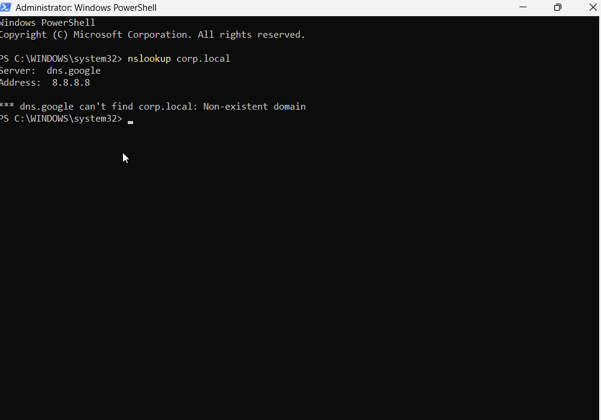
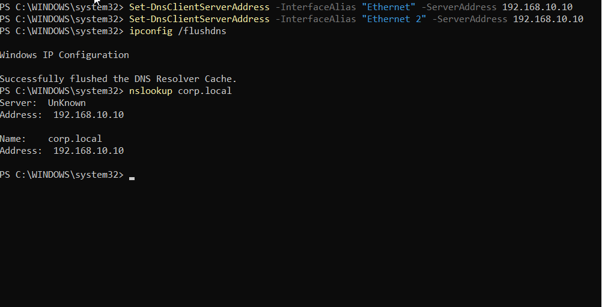
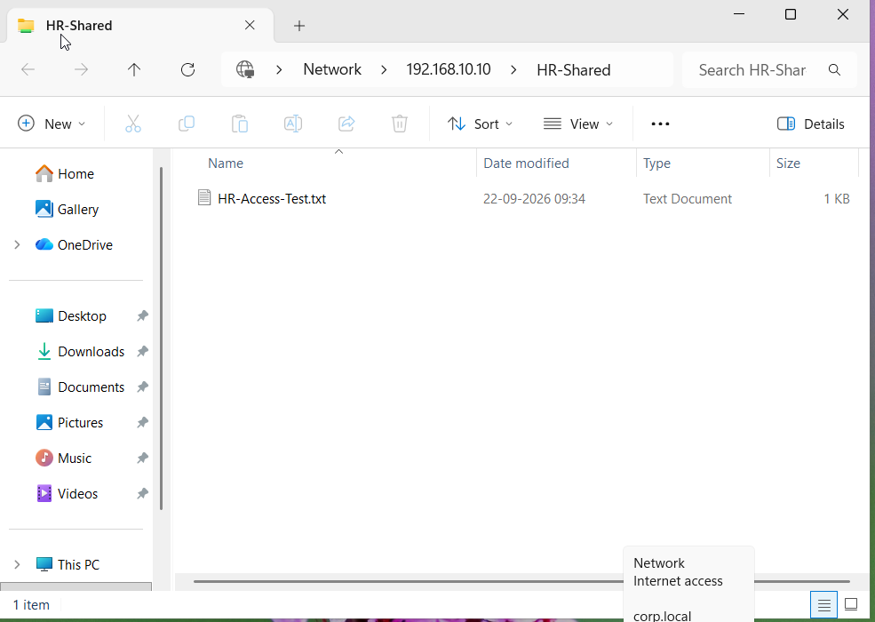

# Ticket 13 — Network Share Works by IP but Not by Hostname

## Scenario

A user reported that they could access a shared folder using the server's IP address, but could not access the same resource using the server hostname.

The help desk investigated the issue and identified a DNS name-resolution problem.

---

## Environment

- Domain Controller: `DC01`
- Client: `AcerLap`
- Domain: `corp.local`
- User: `Neha Sharma`
- Shared Folder: `HR-Shared`

---

## Problem

The shared folder was accessible using:

`\\192.168.10.10\HR-Shared`

However, the issue was related to accessing the same resource using:

`\\DC01\HR-Shared`

The problem was caused by the Windows 11 client using an incorrect DNS server.

---

## Troubleshooting

1. Verified that the shared folder was accessible using the server IP address.
2. Verified that the share was normally accessible using the hostname.
3. Checked the DNS configuration on the Windows 11 client.
4. Simulated an incorrect DNS configuration by changing the client DNS server to `8.8.8.8`.
5. Flushed the DNS resolver cache.
6. Used `nslookup` to test resolution of `DC01` and `corp.local`.
7. Confirmed that the public DNS server could not resolve the internal `corp.local` domain.
8. Restored the correct internal DNS server: `192.168.10.10`.
9. Flushed the DNS cache again.
10. Verified DNS resolution and restored access to the shared folder using the hostname.

---

## Resolution

The Windows 11 client's DNS configuration was corrected to use the domain controller's DNS server:

`192.168.10.10`

The internal hostname and domain could then be resolved correctly.

---

## Verification

The shared folder was successfully accessed using:

`\\DC01\HR-Shared`

DNS resolution was also verified using `nslookup`.

---

## Screenshots

### DNS Resolution Failure

### Correct DNS Server Configuration

### Successful Share Access

---

## Skills Practiced

- DNS troubleshooting
- Internal DNS resolution
- `nslookup`
- DNS client configuration
- Windows networking
- SMB shared-folder troubleshooting
- PowerShell
- `ipconfig /flushdns`
- Help-desk troubleshooting
